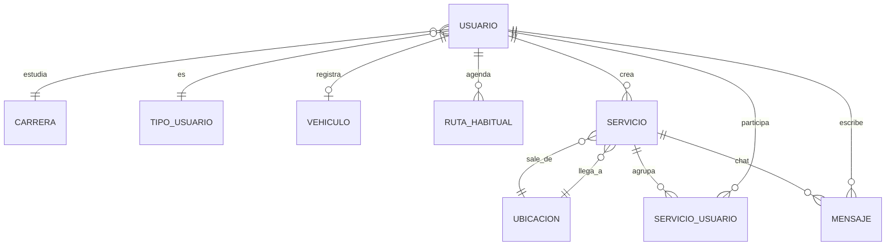

# GoPoli-DB (PostgreSQL)

## Estado del Proyecto

[](https://github.com/GoPoli/GoPoli-DB/actions/workflows/ci.yml)
[](https://github.com/GoPoli/GoPoli-DB/actions/workflows/packaging.yml)

## Descripción

GoPoli-DB contiene la base de datos de **GoPoli**: una imagen de **PostgreSQL 16** que crea el esquema completo y carga los catálogos y datos mínimos en su primer arranque. Es la base que usa [GoPoli-API](https://github.com/GoPoli/GoPoli-API) en desarrollo, en los entornos Docker de la organización y en Kubernetes. En la nube, el equipo usa **Neon** con el mismo esquema.

## Estructura del Proyecto

```text
GoPoli-DB/
├── .github/
│   ├── dependabot.yml                    # Actualización de la imagen base y de las Actions
│   └── workflows/
│       ├── ci.yml                        # Construye la imagen y valida esquema y seed
│       └── packaging.yml                 # Publicación de la imagen en GHCR
│
├── docs/
│   ├── DATABASE_NEON.md                  # Base compartida en Neon y migración de datos
│   └── DOCKER_DB.md                      # PostgreSQL local con Docker
│
├── init/
│   ├── 01_schema.sql                     # Esquema alineado con las entidades JPA
│   └── 02_seed.sql                       # Catálogos, ubicaciones y usuario demo
│
├── scripts/
│   ├── migrate_local_to_neon.ps1         # Exporta la base local e importa en Neon
│   ├── seed_ubicaciones_metro_poli.sql   # Coordenadas de estaciones y salidas del campus
│   └── update_ubicaciones_coordenadas.sql# Correcciones manuales de coordenadas
│
├── .dockerignore
├── .env.example
├── docker-compose.yml                    # Base local con volumen persistente
├── Dockerfile                            # postgres:16-alpine + scripts de init
└── LICENSE
```

## Esquema

`init/01_schema.sql` crea 13 tablas, alineadas con las entidades de la API:

| Grupo | Tablas |
| --- | --- |
| Catálogos | `carrera`, `tipo_usuario`, `estado_usuario`, `tipo_servicio`, `estado_servicio`, `tipo_vehiculo`, `ubicacion` |
| Usuarios | `usuario`, `vehiculo`, `ruta_habitual` |
| Viajes | `servicio`, `servicio_usuario`, `mensaje` |



`init/02_seed.sql` carga carreras, estados y tipos de usuario y viaje, ubicaciones del campus y del metro con coordenadas, y un usuario demo:

| Campo | Valor |
| --- | --- |
| Correo | `demo.local@elpoli.edu.co` |
| Contraseña | `gopoli-local-dev` |

> [!WARNING]
> El usuario demo es solo para desarrollo local. No cargues este seed en una base compartida o productiva.

## Guía de Instalación

### Requisitos Previos

- Docker (Docker Desktop o Docker Engine con Compose v2)

### 1. Ejecución con Docker Compose

```bash
git clone https://github.com/GoPoli/GoPoli-DB.git
cd GoPoli-DB
cp .env.example .env
docker compose up -d --build
```

La base queda en `localhost:5432` (`gopoli` / `gopoli`). Los scripts de `init/` se ejecutan solo cuando el volumen está vacío; para reinicializar usa `docker compose down -v`.

### 2. Creación de la Imagen Docker

```bash
docker build --platform linux/amd64 -t ghcr.io/gopoli/gopoli-db:latest .
```

### 3. Ejecución de la Imagen

```bash
docker run -d --name gopoli-db -p 5432:5432 \
  -e POSTGRES_PASSWORD=gopoli \
  -v gopoli_pgdata:/var/lib/postgresql/data \
  ghcr.io/gopoli/gopoli-db:latest
```

La imagen incluye un `HEALTHCHECK` sobre TCP, por lo que solo se reporta `healthy` cuando terminó de ejecutar los scripts de inicialización.

### 4. Publicación en GitHub Container Registry

La publicación es automática: cada push a `main` construye la imagen y la publica en `ghcr.io/gopoli/gopoli-db` con las etiquetas `latest` y `sha-<commit>`. Un tag `vX.Y.Z` publica además `X.Y.Z` y `X.Y`.

Publicación manual (requiere un token con `write:packages`):

```bash
echo $GHCR_TOKEN | docker login ghcr.io -u <usuario> --password-stdin
docker push ghcr.io/gopoli/gopoli-db:latest
```

## Configuración

| Variable | Descripción | Valor por defecto |
| --- | --- | --- |
| `POSTGRES_DB` | Nombre de la base de datos | `gopoli` |
| `POSTGRES_USER` | Usuario propietario | `gopoli` |
| `POSTGRES_PASSWORD` | Contraseña del usuario (obligatoria) | — |

La imagen no incluye contraseña por defecto: debe definirse siempre al crear el contenedor.

## Guías

- [PostgreSQL local con Docker](docs/DOCKER_DB.md)
- [Base compartida en Neon y migración de datos](docs/DATABASE_NEON.md)
- Stack completo (DB + API + PWA): [GoPoli/.github](https://github.com/GoPoli/.github/tree/main/docker)

## Scripts

| Script | Uso |
| --- | --- |
| `scripts/migrate_local_to_neon.ps1` | Exporta la base local con `pg_dump` e importa en Neon con `pg_restore` |
| `scripts/seed_ubicaciones_metro_poli.sql` | Asigna coordenadas a las ubicaciones conocidas si no se usa el seeder de la API |
| `scripts/update_ubicaciones_coordenadas.sql` | Plantilla para corregir coordenadas a mano |

## CI/CD

| Workflow | Disparador | Qué hace |
| --- | --- | --- |
| `ci.yml` | Push y PR a `main` | Construye la imagen, la arranca y valida tablas y seed |
| `packaging.yml` | Push a `main`, tags `v*.*.*`, manual | Construye y publica la imagen en GHCR |

## Contribución

Lee la [guía de contribución](https://github.com/GoPoli/.github/blob/main/CONTRIBUTING.md) de la organización.

## Licencia

Este proyecto está bajo la licencia MIT. Consulta el archivo [LICENSE](LICENSE) para más detalles.

## Autores

- Michael Daniel ([MaicolD0930](https://github.com/MaicolD0930))
- Jorge Martinez ([GeorgeAMS](https://github.com/GeorgeAMS))
- Marian Lasney
- Sebastián López O ([sebastianlopezo](https://github.com/sebastianlopezo))
