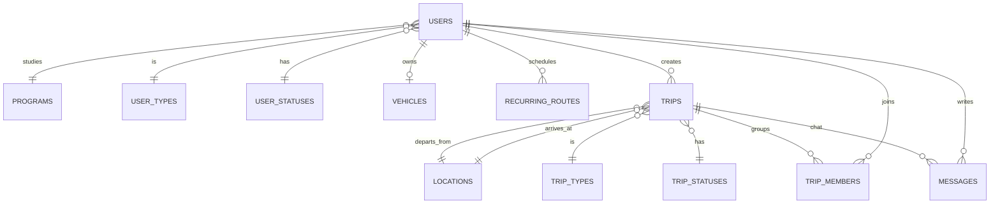

# GoPoli-DB (PostgreSQL)

## Estado del Proyecto

[](https://github.com/GoPoli/GoPoli-DB/actions/workflows/ci.yml)
[](https://github.com/GoPoli/GoPoli-DB/actions/workflows/packaging.yml)

## Descripción

GoPoli-DB contiene la base de datos de **GoPoli**: una imagen de **PostgreSQL 16** que construye el esquema completo, carga los catálogos que la aplicación necesita y, si se pide, precarga datos de demostración en su primer arranque. Es la fuente de verdad del modelo de datos: [GoPoli-API](https://github.com/GoPoli/GoPoli-API) solo **valida** el esquema al arrancar (`ddl-auto=validate`) y nunca lo modifica.

## Estructura del Proyecto

```text
GoPoli-DB/
├── .github/
│   ├── dependabot.yml                # Actualización de la imagen base y de las Actions
│   └── workflows/
│       ├── ci.yml                    # Construye la imagen y valida esquema, catálogos y demo
│       └── packaging.yml             # Publicación de la imagen en GHCR (con SBOM y provenance)
│
├── demo/
│   └── demo_data.sql                 # Usuarios, viajes, chat y agenda de demostración
│
├── docs/
│   ├── DATABASE_NEON.md              # Base compartida en Neon
│   └── DOCKER_DB.md                  # PostgreSQL local con Docker
│
├── init/
│   ├── 01_schema.sql                 # Tablas, llaves, restricciones e índices
│   ├── 02_catalogs.sql               # Carreras, tipos, estados y ubicaciones con coordenadas
│   └── 03_demo_data.sh               # Carga demo/demo_data.sql si GOPOLI_SEED_DEMO=true
│
├── scripts/
│   └── migrate_local_to_neon.ps1     # Copia una base local a Neon (pg_dump / pg_restore)
│
├── .dockerignore
├── .env.example
├── docker-compose.yml                # Base local con volumen persistente
├── Dockerfile                        # postgres:16-alpine sin privilegios + scripts de init
└── LICENSE
```

## Esquema

`init/01_schema.sql` crea 13 tablas con nombres en inglés, llaves foráneas, restricciones de dominio e índices para las consultas de la API:

| Grupo | Tablas |
| --- | --- |
| Catálogos | `programs`, `user_types`, `user_statuses`, `trip_types`, `trip_statuses`, `vehicle_types`, `locations` |
| Usuarios | `users`, `vehicles`, `recurring_routes` |
| Viajes | `trips`, `trip_members`, `messages` |



Reglas que garantiza la base, además de las que valida la API:

| Regla | Restricción |
| --- | --- |
| Un correo por cuenta, sin importar mayúsculas | Índice único `ux_users_email` sobre `upper(email)` |
| Un vehículo por conductor y placas únicas | `vehicles.user_id` y `vehicles.plate` únicos |
| Viajes y rutas de 2 a 4 personas, con salida distinta a la llegada | `CHECK` en `trips` y `recurring_routes` |
| Roles de grupo válidos | `group_role` en (`creator`, `member`) y `participation_role` en (`passenger`, `driver`) |
| Días de la agenda en formato ISO | `weekdays ~ '^[1-7](,[1-7])*$'` |
| Mensajes no vacíos de hasta 1000 caracteres; descripciones de hasta 500 | `CHECK` y `VARCHAR` |
| Al eliminar una cuenta se eliminan sus viajes, membresías, mensajes, rutas y vehículo | `ON DELETE CASCADE` |

## Datos Precargados

### Catálogos (siempre)

`init/02_catalogs.sql` carga lo necesario para que la aplicación funcione desde el primer arranque:

- Carreras: Ingeniería Informática, Ingeniería Civil y Audio Visual.
- Tipos y estados de usuario, de viaje y de vehículo, con los identificadores que usa la API.
- 29 ubicaciones del campus y de las estaciones del metro con latitud y longitud.

### Datos de demostración (opcional)

Con `GOPOLI_SEED_DEMO=true`, `init/03_demo_data.sh` carga `demo/demo_data.sql`:

| Cuenta | Rol | Contenido |
| --- | --- | --- |
| `demo.local@elpoli.edu.co` | Pasajera | Un viaje finalizado en el historial y una ruta habitual (lunes, miércoles y viernes) |
| `conductor.demo@elpoli.edu.co` | Conductor | Vehículo registrado y un viaje activo para el día siguiente con chat |
| `pasajera.demo@elpoli.edu.co` | Pasajera | Miembro del viaje activo y del viaje finalizado |

Todas usan la contraseña `gopoli-local-dev`, guardada con hash BCrypt.

> [!WARNING]
> `GOPOLI_SEED_DEMO` es `false` por defecto en la imagen. Actívalo solo en entornos locales, de demostración o de pruebas; nunca en una base productiva o compartida.

Los scripts de `init/` se ejecutan **solo cuando el volumen está vacío**. Cambiar `GOPOLI_SEED_DEMO` en una base ya creada no tiene efecto: hay que recrear el volumen.

## Guía de Instalación

### Requisitos Previos

- Docker (Docker Desktop o Docker Engine con Compose v2)

### 1. Ejecución con Docker Compose

```bash
git clone https://github.com/GoPoli/GoPoli-DB.git
cd GoPoli-DB
cp .env.example .env
docker compose up -d --build
```

Define `POSTGRES_PASSWORD` en `.env` antes de arrancar. La base queda en `127.0.0.1:5432` con los datos de demostración activados. Para reinicializar desde cero usa `docker compose down -v`.

### 2. Creación de la Imagen Docker

```bash
docker build --platform linux/amd64 -t ghcr.io/gopoli/gopoli-db:latest .
```

### 3. Ejecución de la Imagen

```bash
docker run -d --name gopoli-db -p 127.0.0.1:5432:5432 \
  -e POSTGRES_PASSWORD=<DB_PASSWORD> \
  -e GOPOLI_SEED_DEMO=true \
  -v gopoli_pgdata:/var/lib/postgresql/data \
  ghcr.io/gopoli/gopoli-db:latest
```

La imagen corre como el usuario `postgres` (UID 70), admite sistema de archivos de solo lectura (con `tmpfs` en `/tmp` y `/var/run/postgresql`) e incluye un `HEALTHCHECK` sobre TCP que solo reporta `healthy` cuando terminaron los scripts de inicialización.

### 4. Publicación en GitHub Container Registry

La publicación es automática: cada push a `main` construye la imagen y la publica en `ghcr.io/gopoli/gopoli-db` con las etiquetas `latest` y `sha-<commit>`, junto con su SBOM y la atestación de procedencia. Un tag `vX.Y.Z` publica además `X.Y.Z` y `X.Y`.

## Configuración

| Variable | Descripción | Valor por defecto |
| --- | --- | --- |
| `POSTGRES_DB` | Nombre de la base de datos | `gopoli` |
| `POSTGRES_USER` | Usuario propietario | `gopoli` |
| `POSTGRES_PASSWORD` | Contraseña del usuario (obligatoria) | — |
| `GOPOLI_SEED_DEMO` | Carga los datos de demostración en el primer arranque | `false` |

La imagen no incluye contraseña por defecto: debe definirse siempre al crear el contenedor.

## Guías

- [PostgreSQL local con Docker](docs/DOCKER_DB.md)
- [Base compartida en Neon](docs/DATABASE_NEON.md)
- Stack completo (DB + API + PWA): [GoPoli/.github](https://github.com/GoPoli/.github/tree/main/docker)

## CI/CD

| Workflow | Disparador | Qué hace |
| --- | --- | --- |
| `ci.yml` | Push y PR a `main` | Construye la imagen, la arranca endurecida con y sin datos demo y valida tablas, catálogos y cuentas |
| `packaging.yml` | Push a `main`, tags `v*.*.*`, manual | Construye y publica la imagen en GHCR con SBOM y provenance |

## Contribución

Lee la [guía de contribución](https://github.com/GoPoli/.github/blob/main/CONTRIBUTING.md) de la organización.

## Licencia

Este proyecto está bajo la licencia MIT. Consulta el archivo [LICENSE](LICENSE) para más detalles.

## Autores

- Michael Daniel ([MaicolD0930](https://github.com/MaicolD0930))
- Jorge Martinez ([GeorgeAMS](https://github.com/GeorgeAMS))
- Marian Lasney
- Sebastián López O ([sebastianlopezo](https://github.com/sebastianlopezo))
